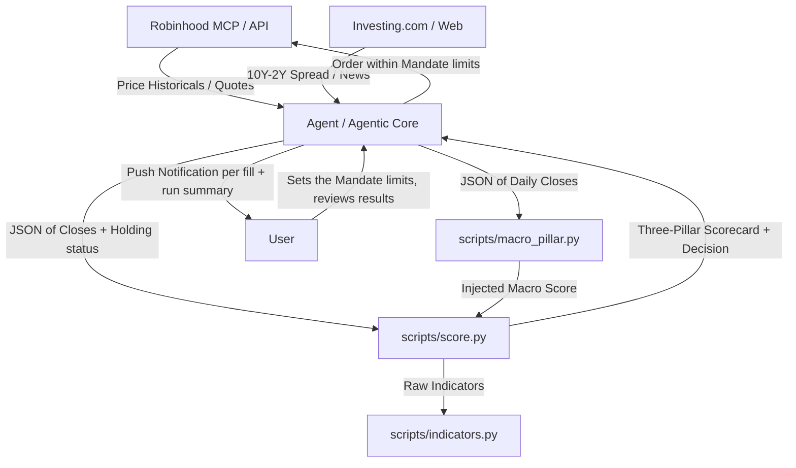

# Agentic Trading Desk

Personal trading desk for technical analysis and short-term portfolio management on stocks and ETFs. The system combines the automation and query capabilities of an Artificial Intelligence agent (via Robinhood MCP protocol) with local deterministic mathematical calculation engines in Python.

The ruling principle is: **the AI fetches data and interacts with the user; the scripts perform the deterministic calculations; the user decides and approves execution.**

---

## 🚀 Project Architecture

The project is designed to operate locally and modularly. All technical indicator computations are delegated to Python 3 scripts that only use the Python standard library (`stdlib`), ensuring speed and zero network dependencies during execution.



### File Structure
*   **[SKILL.md](SKILL.md)**: Operations manual and specific guardrails guiding the AI agent's actions.
*   **[scripts/indicators.py](scripts/indicators.py)**: Mathematical engine to calculate technical indicators without visual estimations.
*   **[scripts/macro_pillar.py](scripts/macro_pillar.py)**: Macro regime detector and cross-asset sentiment scorer.
*   **[scripts/score.py](scripts/score.py)**: Evaluator of the three-pillar framework and exit/entry decision engine.
*   **[gemini-spark/](gemini-spark/)**: Sanitized version of the skill and scripts compatible with Gemini Spark security policies.

---

## 📈 The Three-Pillar Framework

Each analyzed asset is scored in three independent categories with scores from **-2 to +2** (for a consolidated total range of **-6 to +6**):

### 1. Trend
Determined in [scripts/score.py](scripts/score.py#L30) using:
*   Price position relative to the **EMA 20**.
*   Structural crossovers between exponential moving averages: **EMA 20 > EMA 50** and **EMA 50 > EMA 200**.
*   Slope direction of the **EMA 200** (measured relative to 5 bars ago).

### 2. Momentum
Determined in [scripts/score.py](scripts/score.py#L58) combining:
*   **RSI-14** using **Wilder's** smoothing (neutral zone from 45 to 55).
*   Sign of the **MACD (12, 26, 9)** histogram.
*   **TRIX-15** (triple EMA rate of change) compared against its EMA-9 signal line.

**Bollinger Bands** (20/2, population σ) are also computed and used as a supporting exhaustion signal (`%B ≥ 1` flags price at/above the upper band) but do not feed into the numeric momentum score.

### 3. Macro-Sentiment (Macro Environment)
Calculated by the [scripts/macro_pillar.py](scripts/macro_pillar.py) cross-asset analysis script, which weights the following components:
*   **Market Concentration**: RSP/SPY (equal-weight vs. cap-weight S&P 500).
*   **Yield Curve**: 10Y-2Y treasury yield spread (injected from Investing.com).
*   **Corporate Credit**: HYG/LQD ratio (high-yield vs. investment-grade).
*   **Size Factor**: IWM/SPY ratio (small caps vs. large caps).
*   **Asset Preference**: SPY/TLT ratio (equities vs. bonds).
*   **Sector Rotation**: XLY/XLP ratio (cyclical vs. defensive sectors).
*   **Inflationary Correlation**: Rolling SPY-TLT correlation.

---

## 🛠️ Script Usage

The scripts are run via the command line consuming data in JSON format.

### 1. Raw Indicators Computation
To obtain the detailed breakdown of all calculated indicators for an asset:
```bash
python3 scripts/indicators.py input_ticker.json
```
*Expected format for `input_ticker.json`:*
```json
{
  "close": [100.5, 101.2, 102.0, 101.8, 103.1, ...]
}
```

### 2. Macro-Sentiment Scoring
To calculate the regime and macro pillar of the session:
```bash
python3 scripts/macro_pillar.py macro_input.json --json
```
*Expected format for `macro_input.json`:*
```json
{
  "as_of": "2026-07-02",
  "yield_spread": -0.15,
  "series": {
    "SPY": [450.1, 452.3, ...],
    "RSP": [152.0, 151.8, ...],
    "IWM": [198.5, ...],
    "HYG": [...],
    "LQD": [...],
    "TLT": [...],
    "XLY": [...],
    "XLP": [...]
  }
}
```

### 3. Ticker Scoring and Decision
To obtain the complete three-pillar scorecard and action suggestion for the Agentic account:
```bash
python3 scripts/score.py ticker_input.json        # human-readable table
python3 scripts/score.py ticker_input.json --json  # machine-readable output
python3 scripts/score.py                           # self-test with synthetic data
```
*Expected format for `ticker_input.json`:*
```json
{
  "symbol": "AAPL",
  "close": [220.5, 222.1, 221.8, ...],
  "macro_score": 1,
  "holding": true
}
```

The output includes the three-pillar scorecard, active flags (exhaustion / bearish / rebound / death-cross), and one of the following decisions:

| Decision | Context |
|---|---|
| `EXIT / TRIM` | Holding — bullish momentum exhausted |
| `EXIT` | Holding — bearish momentum relentless |
| `RE-ENTRY (new cycle)` | Flat — rebound with healthy EMA structure |
| `TACTICAL REBOUND (counter-trend)` | Flat — rebound inside a death-cross (reduced size, conditional exit on close) |
| `HOLD (ride the cycle)` | Holding — trend and momentum positive |
| `HOLD (under review)` | Holding — weak signals, no full exit trigger yet |
| `WAIT (do not chase)` | Flat — healthy trend but no fresh entry trigger |
| `STAY OUT / AVOID` | Flat — relentless bearish, no rebound |
| `HOLD / OBSERVE` or `OBSERVE` | Mixed signals — no action, watch next close |

Before selecting a decision, the script detects **flags** — specific indicator patterns that signal exhaustion (e.g., RSI turning from overbought, MACD histogram shrinking), bearish persistence, or rebound triggers. The decision cascade prioritizes exit triggers for holders and entry triggers for flat positions. When `macro_score ≤ -1`, the framing is adjusted (tighter targets, reduced size) but the numeric pillar scores remain unchanged.

---

## 🤖 Claude Code Integration

To use this project as a **Skill** with Claude Code for automated trading analysis:

### 1. Add the Skill
Place the `SKILL.md` file in your Claude Code skills directory (typically `~/.claude/code/skills/`):
```bash
# Clone or copy this repository to your skills folder
cp -r /path/to/agentic-trading-desk ~/.claude/code/skills/agentic-trading-desk
```

Or reference it directly from this repository.

### 2. Agent Operation
Once loaded, Claude Code will:
* Automatically use this skill when you ask to analyze tickers, review positions, or make trading decisions
* Fetch data via Robinhood MCP protocol
* Call the Python scripts (`scripts/indicators.py`, `scripts/score.py`, `scripts/macro_pillar.py`) for deterministic calculations
* Present the three-pillar scorecard with actionable decisions
* **Execute autonomously in the Agentic account under the Autonomous Execution Mandate** — market orders during regular hours, marketable limit orders outside them, never stop orders, within hard caps on order size, new positions per session, and cash reserve. See the Mandate section in [SKILL.md](SKILL.md) for the exact limits, and set them to your own risk tolerance before enabling.

### 3. Example Workflow
```
You: "Analyze AAPL for a potential entry"

1. Data Fetching (Robinhood MCP)
   → Fetches AAPL daily historicals (~290 bars for EMA 200)
   → Fetches live quote (current price / last close)
   → Checks if there is an open position → sets holding = true/false

2. Macro Pillar (once per session, shared across all tickers)
   → Fetches historicals for 8 ETFs: SPY, RSP, IWM, HYG, LQD, TLT, XLY, XLP
   → Retrieves 10Y-2Y yield spread from Investing.com
   → Runs: python3 scripts/macro_pillar.py → macro_score (-2 to +2)

3. Ticker Scoring
   → Assembles JSON with {symbol, close, macro_score, holding}
   → Runs: python3 scripts/score.py → three-pillar scorecard + decision
     (score.py calls indicators.py internally for all calculations)

4. Qualitative Context (reinforcement, does not alter scores)
   → News and macro context from Investing.com
   → Analyst consensus and price targets from Google Finance

5. Execution and Reporting
   → Returns: Scorecard, flags, and action (RE-ENTRY, HOLD, EXIT, etc.)
   → If the action is executable and inside the Mandate limits: review_*_order,
     then place_*_order within the order-type rule, then a push notification
   → If it falls outside the limits: no trade, and the reason is reported
```

The agent operates under the principle: **AI fetches data; scripts perform deterministic calculations; the framework decides and the agent executes within limits you set in advance.** Discretion is deliberately absent — if `score.py` did not emit an executable decision, there is no trade.

---

## 📰 External Qualitative Context (Reinforcement)

To complement the purely technical nature of the deterministic scripts, the AI agent integrates a real-time **qualitative reinforcement analysis** before presenting the final recommendation:

1.  **News and Macro**: Dynamically retrieved from **Investing.com** (validated source to avoid prompt injection risks).
2.  **Analyst Consensus and Reports**: Queries **Google Finance Beta** (`https://www.google.com/finance/beta/quote/<TICKER>:<EXCHANGE>?tab=analysis`) to extract:
    *   Overall consensus (*Buy/Hold/Sell*).
    *   12-month price targets (average, maximum, minimum) contrasted against the current price of the ticker.
    *   Recent earnings results (actual vs. estimated).
    *   Recent analyst rating changes (< 2 weeks).

*Note: This information is presented to the user alongside the three-pillar scorecard as interpretive context; **it does not directly alter** the mathematical score returned by the scripts, ensuring that quantitative triggers and risk management remain 100% deterministic.*

---

## 🛡️ Guardrails and Operation (Non-Negotiable)

1.  **Special Position Protection**: Certain positions can be designated as *protected* (e.g., restricted stock grants). Protected tickers are never evaluated for selling or trimming in exit suggestions.
2.  **Account Segregation**: The tradable account is identified by the broker's own agent-tradable flag from `get_accounts` — never by nickname, never by a hardcoded account number. Orders against any other account are rejected by the broker.
    *   **Agentic**: Oriented toward fast returns and capital rotation via tactical trades and defined cycles. The only account the Mandate covers.
    *   **Individual** (Margin Account): Core passive long-term investing. Analysis only.
3.  **Buying Power**: Always taken from `get_portfolio.buying_power` rather than derived. Account type matters and can change: a cash account settles T+1, while a limited-margin account can trade unsettled proceeds immediately.
4.  **Mandatory Simulation**: Every order passes through `review_*_order` before `place_*_order`. If the simulation disagrees with the computed order by more than 1% on price or quantity, the trade is aborted and reported.
5.  **Mandate Limits Are Hard**: A limit exceeded is not a prompt to ask for permission — it is a stop. The agent does not trade and reports why. Circuit breakers halt new buys if the account is down more than 4% on the day, or if the data does not reconcile.
6.  **No Backtest**: This framework has not been backtested. A trigger firing does not make it correct. Set the Mandate limits to a size where being wrong is survivable.

---

## 🔒 Enforcing the Mandate (`hooks/mandate-order-guard.sh`)

The Mandate constrains order type by session: **`market` during regular hours** (a signal should put you in the trade, not leave a limit resting), **marketable `limit` outside them**, and **never a stop order**. That sentence is **prose addressed to the model** — nothing enforces it, and in practice it has been broken.

The break is not carelessness; it is structural. The Robinhood MCP schema states:

> `dollar_amount`: USD notional. **Only valid with `type=market`.**

So any run that sizes an order in dollars — the natural way to think about a small account — is pushed by the schema itself into a market order. In regular hours that is now fine; after hours it is not, because the broker will not execute a market order then and it queues blind to the next open. The schema further implies fractional shares require `type=market`. **That part is wrong**: a fractional *limit* order is accepted (verified via `review_equity_order`: DIA buy limit `quantity=0.400000` @ 534.50, empty `order_checks`). The correct sizing is `quantity = dollars / limit_price`.

`hooks/mandate-order-guard.sh` is a `PreToolUse` hook that closes this deterministically. It runs in the harness, outside the model, and denies the tool call before it leaves:

```json
{
  "hooks": {
    "SessionStart": [
      {
        "matcher": "startup",
        "hooks": [
          { "type": "command", "command": "\"$CLAUDE_PROJECT_DIR\"/scripts/session-setup.sh", "timeout": 120 }
        ]
      }
    ],
    "PreToolUse": [
      {
        "matcher": "mcp__Robinhood__place_equity_order",
        "hooks": [
          { "type": "command", "command": "\"$CLAUDE_PROJECT_DIR\"/hooks/mandate-order-guard.sh", "timeout": 10 }
        ]
      }
    ]
  }
}
```

That block is `.claude/settings.json`, shipped with the desk rather than pasted
into `~/.claude` by hand.

| Order | Guard |
|---|---|
| `market` (+ `dollar_amount` or quantity), `market_hours=regular_hours` | ALLOW |
| `market`, any other `market_hours` | DENY |
| `limit` + `limit_price`, fractional or whole | ALLOW |
| `limit` without `limit_price` | DENY |
| `limit` + `dollar_amount` | DENY — the schema would flip it to `market` |
| `stop_market` / `stop_limit`, any session | DENY |
| any order with notional > $1,200 | DENY |
| any order, when `jq` is not installed | DENY — the guard fails closed |

**The guard depends on `jq` and fails closed without it.** Every rule above is
implemented with `jq`; without it each field parse returns empty, `deny()` cannot
emit its JSON either, and the script exits 0 with no output — which the hook
runner reads as ALLOW. A guard that silently permits everything when a dependency
is missing is worse than no guard, so it now denies up front instead. Verified
2026-08-26 against a `PATH` with no `jq`: the previous revision let a
`stop_market` through with empty output and `rc=0`. `scripts/session-setup.sh`
installs `jq` on every boot — on a scheduled-run container it is not there by
default.

**Where to install it so it survives.** The scheduled-run container is ephemeral — a hook written inside a session is gone by the next one.

**This desk now carries its own wiring.** `.claude/settings.json` is
version-controlled alongside the guard and points both hooks at paths inside the
desk via `$CLAUDE_PROJECT_DIR`, so nothing has to be copied into `~/.claude` and
nothing is lost when a container reboots:

*   `PreToolUse` → `hooks/mandate-order-guard.sh` (the order guard itself).
*   `SessionStart` → `scripts/session-setup.sh`, which installs `jq`, marks the
    guard executable, and **smoke-tests it** by feeding it a `stop_market` probe.
    If the guard does not deny that probe, the setup script exits non-zero and
    the session refuses to start. A guard that answers "allow" to a prohibited
    order is not installed, it is decorative — better to block the session than
    to trade behind a guard that is not evaluating anything.

*   **Run from a checkout of this repo**: nothing to do beyond having it open as
    the project directory.
*   **Cloud runs** (claude.ai/code): the environment's **network access must be
    `Trusted`** or higher, or `apt-get` cannot reach the Ubuntu archives and
    `session-setup.sh` aborts by design. Trusted is the default.
*   **Installed as a skill** (`~/.claude/skills/agentic-trading-desk/`): a skill
    directory is **not** a project directory, so `.claude/settings.json` inside
    it is never read and neither hook loads on its own. The files travel with
    the skill so the wiring is one copy away, but in that mode the enforcement
    that actually runs is the session-start check in `SKILL.md`, which invokes
    `scripts/session-setup.sh` and refuses to execute orders if the probe is not
    denied. To get the real harness-level guard, point a project's
    `.claude/settings.json` at these two scripts.
*   **Caveat worth checking**: hooks only load for sessions whose project
    directory is the one holding that `settings.json`. If a scheduled run
    executes against a different repo, these hooks never load and the desk runs
    unguarded — confirm which repository the scheduled session opens.

See https://code.claude.com/docs/en/claude-code-on-the-web

Without one of those, only the SKILL.md rule applies — which is what already proved insufficient.
