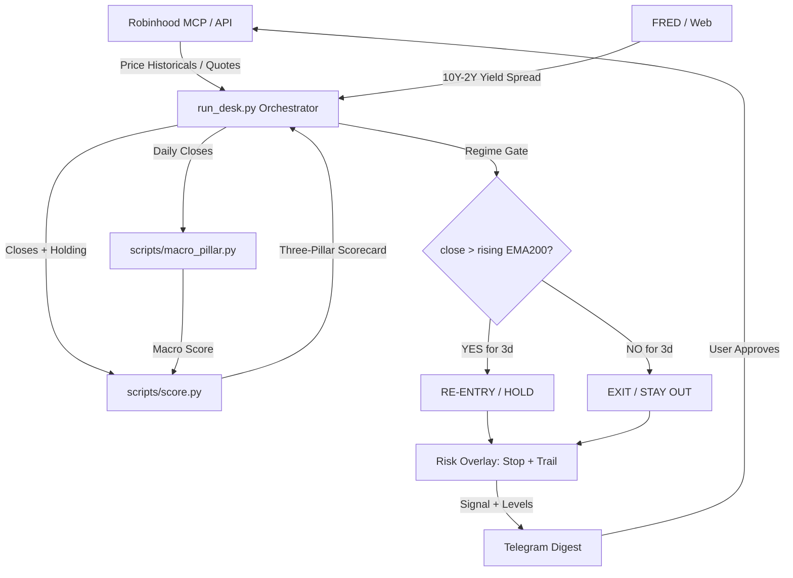

# Agentic Trading Desk

Personal trading desk for technical analysis and short-term portfolio management on stocks and ETFs. The system combines the automation and query capabilities of an Artificial Intelligence agent (via Robinhood MCP protocol) with local deterministic mathematical calculation engines in Python.

The ruling principle is: **the AI fetches data and interacts with the user; the scripts perform the deterministic calculations; the user decides and approves execution.**

---

## 📈 Active Strategy: Regime-V4

The desk runs a **validated trend-regime strategy** on SPY, replacing the original three-pillar counter-trend engine after rigorous backtesting revealed the original engine [lost money out-of-sample](#why-the-original-engine-was-replaced). Full documentation: **[STRATEGY.md](STRATEGY.md)**.

### The signal (one sentence)

> **Be long SPY when its closing price is above the 200-day EMA *and* the EMA200 is rising; be flat (cash) otherwise.**

A 3-day anti-whipsaw confirmation filter prevents churning when price hovers near the regime line, and a hard stop-loss / trailing take-profit overlay provides catastrophic-loss protection.

### Backtest results (2014–2026, out-of-sample)

| Strategy | Return | CAGR | Sharpe | Max Drawdown | Trades |
|---|---|---|---|---|---|
| Buy & Hold | +79.5% | 15.37% | 0.94 | −19.0% | 0 |
| **Regime-V4 + 3d confirm (ACTIVE)** | **+50.6%** | **10.52%** | **0.99** | **−10.0%** | **14** |
| Old three-pillar engine | −1.4% | −0.35% | 0.02 | −24.2% | 32 |

The strategy matches buy-and-hold on risk-adjusted terms (Sharpe ~0.99 vs 0.94) while cutting maximum drawdown roughly in half (−10% vs −19%). Buy-and-hold still wins on raw return in a bull market — see [Honest Caveats in STRATEGY.md](STRATEGY.md#honest-caveats).

### Actionable levels (every signal)

Each twice-daily Telegram digest includes concrete price levels for alerts/orders:

```
🎯 ACTIONABLE LEVELS
  • Regime line (EMA200): 694.67  (price +8.7% above)
  • Regime flips OFF: 3 consecutive closes < 694.67
  • Hard stop (sell alert): 667.59
  • Trailing arms at: 787.61 (+5% from entry 750.10)
```

### Configuration

All tunable parameters live in [`scripts/desk_config.json`](scripts/desk_config.json):

```json
{
  "strategy_mode": "regime_v4",
  "regime_confirm_days": 3,
  "risk_params": {
    "stop_loss_pct": 0.11,
    "trail_arm_pct": 0.05,
    "trail_giveback_pct": 0.03
  }
}
```

Set `strategy_mode` to `three_pillar` to revert to the original engine. Set `regime_confirm_days` to `1` to disable anti-whipsaw. Bad values are ignored with safe defaults.

---

## 🚀 Project Architecture

The project operates locally and modularly. All technical indicator computations are delegated to Python 3 scripts using only the standard library (`stdlib`), ensuring speed and zero network dependencies during execution.



### File Structure

#### Core strategy engine
| File | Purpose |
|---|---|
| [`run_desk.py`](scripts/run_desk.py) | Live orchestrator: data → score → regime gate → risk overlay → report |
| [`score.py`](scripts/score.py) | Three-pillar scorer + exhaustion/rebound decision engine |
| [`indicators.py`](scripts/indicators.py) | Deterministic technical indicators (EMA/RSI/MACD/TRIX/BB) |
| [`macro_pillar.py`](scripts/macro_pillar.py) | Cross-asset macro regime detector and sentiment scorer |
| [`desk_config.json`](scripts/desk_config.json) | Single source of truth for live parameters |

#### Data & auth
| File | Purpose |
|---|---|
| [`rh_data.py`](scripts/rh_data.py) | Robinhood MCP data provider (historicals, quotes, positions) |
| [`robinhood_mcp.py`](scripts/robinhood_mcp.py) | MCP protocol client |
| [`robinhood_auth.py`](scripts/robinhood_auth.py) | OAuth2 PKCE token management + auto-refresh |

#### Evaluation & backtesting
| File | Purpose |
|---|---|
| [`strategy_eval.py`](scripts/strategy_eval.py) | Daily evaluator: signal-mix diagnostics, 323-bar backtest, strategy scoreboard |
| [`eod_eval.py`](scripts/eod_eval.py) | End-of-day signal grading (mark each signal to the official close) |
| [`backtest.py`](scripts/backtest.py) | Walk-forward backtest harness (Phase A: score bars, Phase B: replay rules) |
| [`experiments.py`](scripts/experiments.py) | V0–V4 strategy variant comparison with train/test split |
| [`experiments_v2.py`](scripts/experiments_v2.py) | Whipsaw refinement variants (R0–R4: hysteresis, confirmation, month-end) |
| [`sweep_v4.py`](scripts/sweep_v4.py) | Parameter sensitivity grid (45 stop/arm/giveback combos) |
| [`test_confirmation.py`](scripts/test_confirmation.py) | Unit tests for the anti-whipsaw confirmation counter |

#### Documentation
| File | Purpose |
|---|---|
| [`STRATEGY.md`](STRATEGY.md) | Comprehensive strategy documentation (risk-adjusted performance, drawdown analysis, backtesting methodology, honest caveats) |
| [`SKILL.md`](SKILL.md) | Claude Code agent operations manual |

---

## 📊 The Three-Pillar Framework (Context Layer)

The three-pillar framework is still computed and displayed in every signal for **context**, but entry/exit decisions are now driven by the regime gate (see [Active Strategy](#-active-strategy-regime-v4) above).

Each analyzed asset is scored in three independent categories with scores from **-2 to +2** (consolidated total: **-6 to +6**):

### 1. Trend
Determined in [scripts/score.py](scripts/score.py) using:
*   Price position relative to the **EMA 20**.
*   Structural crossovers: **EMA 20 > EMA 50** and **EMA 50 > EMA 200**.
*   Slope direction of the **EMA 200** (measured relative to 5 bars ago).

### 2. Momentum
Determined in [scripts/score.py](scripts/score.py) combining:
*   **RSI-14** using **Wilder's** smoothing (neutral zone 45–55).
*   Sign of the **MACD (12, 26, 9)** histogram.
*   **TRIX-15** (triple EMA rate of change) vs its EMA-9 signal line.

**Bollinger Bands** (20/2, population σ) are computed as a supporting exhaustion signal (`%B ≥ 1` flags price at/above the upper band) but do not feed into the numeric momentum score.

### 3. Macro-Sentiment
Calculated by [scripts/macro_pillar.py](scripts/macro_pillar.py), which weights:
*   **Market Concentration**: RSP/SPY (equal-weight vs cap-weight S&P 500).
*   **Yield Curve**: 10Y-2Y treasury yield spread (from FRED).
*   **Corporate Credit**: HYG/LQD ratio (high-yield vs investment-grade).
*   **Size Factor**: IWM/SPY ratio (small caps vs large caps).
*   **Asset Preference**: SPY/TLT ratio (equities vs bonds).
*   **Sector Rotation**: XLY/XLP ratio (cyclical vs defensive).
*   **Inflationary Correlation**: Rolling SPY-TLT correlation.

---

## ⚠️ Why the Original Engine Was Replaced

A rigorous backtest over 2,945 trading days (Oct 2014 — Jul 2026) with a 65/35 train/test split revealed the original three-pillar counter-trend engine was **fundamentally broken**:

| Metric | Old Engine | Regime-V4 | Buy & Hold |
|---|---|---|---|
| Full-history return | +10.2% | +185.8% | +284.1% |
| Full-history Sharpe | 0.13 | **0.84** | 0.74 |
| Full-history MaxDD | −35.5% | **−20.2%** | −34.1% |
| OOS return | **−1.4%** (lost money) | +50.6% | +79.5% |
| OOS Sharpe | 0.02 | **0.99** | 0.94 |

Root cause: the composite pillar score was **inversely correlated** with forward returns at every horizon (+1d: −0.09, +3d: −0.15, +5d: −0.12). The counter-trend "buy the rebound" entries were systematically buying dips that kept falling.

Full analysis and methodology: **[STRATEGY.md](STRATEGY.md)**.

---

## 🛠️ Script Usage

### Running the live desk (automated via cron)

```bash
export DESK_TICKER=SPY
python3 scripts/run_desk.py    # Full signal: score → regime gate → risk → actionable levels
```

### Backtesting

```bash
export DESK_TICKER=SPY

# Fetch data + compute scored bars (cached after first run)
python3 scripts/backtest.py --refresh

# Strategy variant comparison (train/test split)
python3 scripts/experiments.py

# Whipsaw refinement variants
python3 scripts/experiments_v2.py

# Parameter sensitivity sweep
python3 scripts/sweep_v4.py
```

### Individual components

```bash
# Raw indicators for a ticker
python3 scripts/indicators.py input_ticker.json

# Macro-sentiment scoring
python3 scripts/macro_pillar.py macro_input.json --json

# Three-pillar scorecard + decision
python3 scripts/score.py ticker_input.json        # human-readable
python3 scripts/score.py ticker_input.json --json  # machine-readable
python3 scripts/score.py                           # self-test with synthetic data
```

See [STRATEGY.md § Reproducing the Results](STRATEGY.md#reproducing-the-results) for full instructions.

---

## 🤖 Claude Code Integration

To use this project as a **Skill** with Claude Code for automated trading analysis:

### 1. Add the Skill
Place the `SKILL.md` file in your Claude Code skills directory (typically `~/.claude/code/skills/`):
```bash
cp -r /path/to/agentic-trading-desk ~/.claude/code/skills/agentic-trading-desk
```

### 2. Agent Operation
Once loaded, Claude Code will:
* Automatically use this skill when you ask to analyze tickers, review positions, or make trading decisions
* Fetch data via Robinhood MCP protocol
* Call the Python scripts for deterministic calculations
* Present the regime signal + three-pillar context scorecard with actionable levels
* **Never execute orders without your explicit confirmation**

### 3. Example Workflow
```
You: "Analyze SPY for a potential entry"

1. Data Fetching (Robinhood MCP)
   → Fetches SPY daily historicals (~550 bars for EMA 200 + warmup)
   → Fetches live quote (current price / last close)
   → Checks if there is an open position → sets holding = true/false

2. Macro Pillar (once per session, shared across all tickers)
   → Fetches historicals for 8 ETFs: SPY, RSP, IWM, HYG, LQD, TLT, XLY, XLP
   → Retrieves 10Y-2Y yield spread from FRED
   → Runs: python3 scripts/macro_pillar.py → macro_score (-2 to +2)

3. Ticker Scoring + Regime Gate
   → score.py computes three-pillar scorecard (context display)
   → run_desk.regime_action() checks: close > rising EMA200 for 3 consecutive days?
   → Risk overlay: hard stop (-11%) + trailing take-profit (arm +5%, give -3%)

4. Presentation and Confirmation
   → Scorecard, regime signal, actionable price levels, risk status
   → You review and confirm before any order execution
```

---

## 📰 External Qualitative Context (Reinforcement)

To complement the deterministic engines, the AI agent integrates real-time **qualitative reinforcement**:

1.  **News and Macro**: Dynamically retrieved from **Investing.com**.
2.  **Analyst Consensus**: From **Google Finance Beta** — consensus rating, 12-month price targets, recent earnings, analyst changes.

*This information is presented alongside the scorecard as interpretive context; **it does not alter** the mathematical scores or regime signal.*

---

## 🛡️ Guardrails and Operation (Non-Negotiable)

1.  **Signal-Only**: The system emits signals and actionable levels; the user decides and approves every order. The word "SUGGESTED" appears before every action.
2.  **Fail-Safe**: If any critical step fails (data fetch, auth, scoring), `run_desk.py` prints an ABORT notice and leaves the position state untouched.
3.  **Config-Driven**: All parameters in `desk_config.json`. Bad values are ignored with safe defaults. Strategy is reversible with a one-word config change.
4.  **Special Position Protection**: Certain positions can be designated as *protected* (never evaluated for selling/trimming).
5.  **Account Segregation**: Agentic (Cash Account) for tactical trades; Individual (Margin Account) for core passive investing.
6.  **T+1 Liquidity**: Only settled capital counts as buying power before placing buy orders.
7.  **Mandatory Confirmation**: Every order must pass `review_*_order` and be approved by the user before `place_*_order`.
