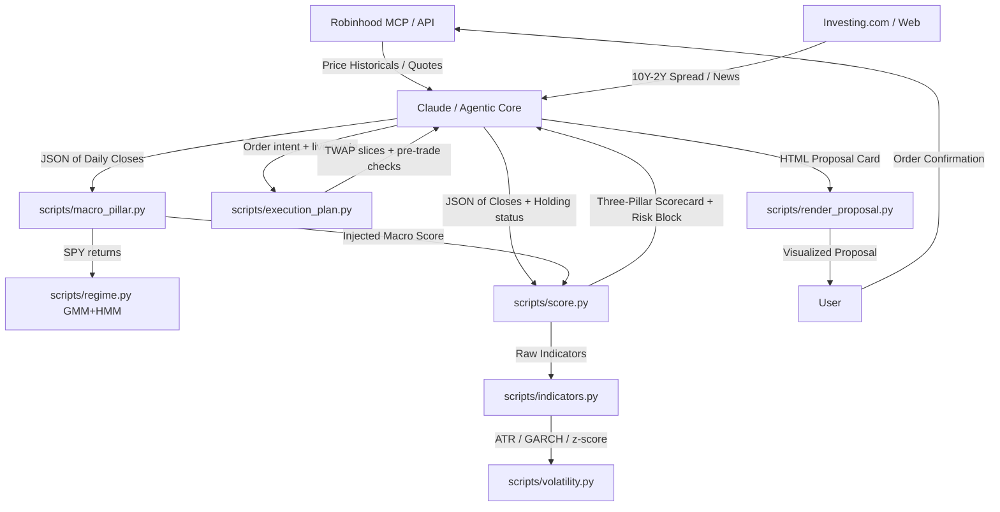

# Agentic Trading Desk

Personal trading desk for technical analysis and short-term portfolio management on stocks and ETFs. The system combines the automation and query capabilities of an Artificial Intelligence agent (via Robinhood MCP protocol) with local deterministic mathematical calculation engines in Python.

The ruling principle is: **the AI fetches data and interacts with the user; the scripts perform the deterministic calculations; the user decides and approves execution.**

---

## 🚀 Project Architecture

The project is designed to operate locally and modularly. All technical indicator computations are delegated to Python 3 scripts that only use the Python standard library (`stdlib`), ensuring speed and zero network dependencies during execution.



### File Structure
*   **[SKILL.md](SKILL.md)**: Operations manual and specific guardrails guiding the AI agent's actions.
*   **[scripts/indicators.py](scripts/indicators.py)**: Mathematical engine to calculate technical indicators without visual estimations.
*   **[scripts/volatility.py](scripts/volatility.py)**: Volatility & mean-reversion layer — ATR, chandelier stops, EWMA vol, deterministic GARCH(1,1), AR(1) half-life, z-scores, vol-target sizing.
*   **[scripts/regime.py](scripts/regime.py)**: Statistical regime detector — 2-state Gaussian Mixture (EM, quantile init) smoothed by a sticky HMM. Fully deterministic.
*   **[scripts/macro_pillar.py](scripts/macro_pillar.py)**: Macro regime detector and cross-asset sentiment scorer (now includes the GMM/HMM vol regime).
*   **[scripts/score.py](scripts/score.py)**: Evaluator of the three-pillar framework and exit/entry decision engine, with ATR-based risk block.
*   **[scripts/execution_plan.py](scripts/execution_plan.py)**: Execution planner — TWAP/VWAP-lite slicing, limit pricing by urgency, staleness/spread/imbalance/participation pre-trade checks.
*   **[scripts/backtest.py](scripts/backtest.py)**: No-lookahead replay of the exact production rules with walk-forward segments and lag×cost sensitivity grid.
*   **[scripts/render_proposal.py](scripts/render_proposal.py)**: Self-contained HTML action card showing exactly what is about to be executed, pending approval.

---

## 📈 The Three-Pillar Framework

Each analyzed asset is scored in three independent categories with scores from **-2 to +2** (for a consolidated total range of **-6 to +6**):

### 1. Trend
Determined in [scripts/score.py](scripts/score.py#L30) using:
*   Price position relative to the **EMA 20**.
*   Structural crossovers between exponential moving averages: **EMA 20 > EMA 50** and **EMA 50 > EMA 200**.
*   Slope direction of the **EMA 200** (measured relative to 5 bars ago).

### 2. Momentum
Determined in [scripts/score.py](scripts/score.py#L58) combining:
*   **RSI-14** using **Wilder's** smoothing (neutral zone from 45 to 55).
*   Sign of the **MACD (12, 26, 9)** histogram.
*   **TRIX-15** (triple EMA rate of change) compared against its EMA-9 signal line.

**Bollinger Bands** (20/2, population σ) are also computed and used as a supporting exhaustion signal (`%B ≥ 1` flags price at/above the upper band) but do not feed into the numeric momentum score.

**Volatility-adjusted flags** (from [scripts/volatility.py](scripts/volatility.py)): the raw "10% above EMA20" stretch threshold is replaced by an **ATR-normalized stretch** (≥2.5 ATRs above EMA20) whenever ATR is available, and a **20-day z-score ≥ +2σ** flags a statistical extreme. On the rebound side, a **z ≤ −2σ washout** counts as an entry signal only when the AR(1) half-life confirms the name is mean-reverting.

### 3. Macro-Sentiment (Macro Environment)
Calculated by the [scripts/macro_pillar.py](scripts/macro_pillar.py) cross-asset analysis script, which weights the following components:
*   **Market Concentration**: RSP/SPY (equal-weight vs. cap-weight S&P 500).
*   **Yield Curve**: 10Y-2Y treasury yield spread (injected from Investing.com).
*   **Corporate Credit**: HYG/LQD ratio (high-yield vs. investment-grade).
*   **Size Factor**: IWM/SPY ratio (small caps vs. large caps).
*   **Asset Preference**: SPY/TLT ratio (equities vs. bonds).
*   **Sector Rotation**: XLY/XLP ratio (cyclical vs. defensive sectors).
*   **Inflationary Correlation**: Rolling SPY-TLT correlation.
*   **Statistical Vol Regime** ([scripts/regime.py](scripts/regime.py)): a 2-state Gaussian Mixture is fitted on SPY daily log returns by EM (deterministic quantile initialization — no RNG), then smoothed with a sticky 2-state HMM (forward-backward, p_stay = 0.97) so the regime only flips on persistent evidence. A high-confidence *turbulent* state caps the macro pillar at 0 even when the (slower) ratio trends still look benign.

---

## 🛠️ Script Usage

The scripts are run via the command line consuming data in JSON format.

### 1. Raw Indicators Computation
To obtain the detailed breakdown of all calculated indicators for an asset:
```bash
python3 scripts/indicators.py input_ticker.json
```
*Expected format for `input_ticker.json`:*
```json
{
  "close": [100.5, 101.2, 102.0, 101.8, 103.1, ...]
}
```

### 2. Macro-Sentiment Scoring
To calculate the regime and macro pillar of the session:
```bash
python3 scripts/macro_pillar.py macro_input.json --json
```
*Expected format for `macro_input.json`:*
```json
{
  "as_of": "2026-07-02",
  "yield_spread": -0.15,
  "series": {
    "SPY": [450.1, 452.3, ...],
    "RSP": [152.0, 151.8, ...],
    "IWM": [198.5, ...],
    "HYG": [...],
    "LQD": [...],
    "TLT": [...],
    "XLY": [...],
    "XLP": [...]
  }
}
```

### 3. Ticker Scoring and Decision
To obtain the complete three-pillar scorecard and action suggestion for the Agentic account:
```bash
python3 scripts/score.py ticker_input.json        # human-readable table
python3 scripts/score.py ticker_input.json --json  # machine-readable output
python3 scripts/score.py                           # self-test with synthetic data
```
*Expected format for `ticker_input.json`:*
```json
{
  "symbol": "AAPL",
  "close": [220.5, 222.1, 221.8, ...],
  "macro_score": 1,
  "holding": true
}
```

The output includes the three-pillar scorecard, active flags (exhaustion / bearish / rebound / death-cross), and one of the following decisions:

| Decision | Context |
|---|---|
| `EXIT / TRIM` | Holding — bullish momentum exhausted |
| `EXIT` | Holding — bearish momentum relentless |
| `RE-ENTRY (new cycle)` | Flat — rebound with healthy EMA structure |
| `TACTICAL REBOUND (counter-trend)` | Flat — rebound inside a death-cross (reduced size, tight stop) |
| `HOLD (ride the cycle)` | Holding — trend and momentum positive |
| `HOLD (under review)` | Holding — weak signals, no full exit trigger yet |
| `WAIT (do not chase)` | Flat — healthy trend but no fresh entry trigger |
| `STAY OUT / AVOID` | Flat — relentless bearish, no rebound |
| `HOLD / OBSERVE` or `OBSERVE` | Mixed signals — no action, watch next close |

Before selecting a decision, the script detects **flags** — specific indicator patterns that signal exhaustion (e.g., RSI turning from overbought, MACD histogram shrinking), bearish persistence, or rebound triggers. The decision cascade prioritizes exit triggers for holders and entry triggers for flat positions. When `macro_score ≤ -1`, the framing is adjusted (tighter targets, reduced size) but the numeric pillar scores remain unchanged.

Every scorecard now carries a **risk block**: a 3×ATR chandelier trailing stop (1.5×ATR for tactical counter-trend trades, at half size), the vol-target position fraction (15% annualized target vs. the GARCH(1,1) forecast vol), and a GARCH vol-expansion warning when conditional vol runs ≥1.3× its long-run level. Passing `high`/`low` arrays alongside `close` sharpens ATR from true range; close-only input degrades gracefully.

### 4. Volatility & Mean-Reversion Engine
```bash
python3 scripts/volatility.py input_ticker.json
```
Standalone access to ATR-14 (Wilder), chandelier stop, EWMA vol (λ=0.94), a deterministic GARCH(1,1) MLE fit (fixed-start Nelder–Mead — same input, same output), AR(1)/OU mean-reversion half-life, 20-day z-score, and the vol-target sizing fraction.

### 5. Execution Planning (TWAP/VWAP + Pre-Trade Checks)
```bash
python3 scripts/execution_plan.py order.json          # human-readable plan
python3 scripts/execution_plan.py order.json --json
```
*Expected format for `order.json`:*
```json
{
  "symbol": "AAPL", "side": "buy", "qty": 1200,
  "quote": {"bid": 227.10, "ask": 227.18, "last": 227.12,
             "bid_size": 400, "ask_size": 900, "age_sec": 3.2},
  "adv": 48000000, "urgency": "normal", "horizon_min": 30
}
```
The planner never proposes a naked market order. It prices a limit by urgency (passive / mid / cross-75%-of-spread), slices via TWAP (or VWAP-lite when an intraday `volume_curve` is provided), caps participation at 5% of expected interval volume, and runs four pre-trade checks: **quote staleness** (blocks ≥30s — MCP round-trip latency makes stale quotes the main retail slippage source), **spread width** (≥20 bps forces passive-only), **L1 order-book imbalance** (warns when opposing size ≥3× own side), and **participation**. Any `BLOCK` sets status to `BLOCKED`; the human sees the checks before approving.

### 6. Backtesting (No-Lookahead Replay of the Exact Rules)
```bash
python3 scripts/backtest.py history.json --splits 4 --sensitivity
```
*Input:* `{"symbol", "close": [...], "high": [...]?, "low": [...]?, "dates": [...]?}` with multi-year daily history.

The backtester replays **the same `score.py` code that runs in production** — not a re-implementation — feeding it only the prefix of history at each bar (lookahead is impossible by construction). Decisions fill at the *next* close (`--lag`, default 1) with per-side slippage (`--cost-bps`, default 5), and the ATR trailing stop is honored between signals. Since the rules carry no fitted parameters, anti-curve-fitting rigor comes from **stability evidence**:
* `--splits N` — contiguous walk-forward segments, each reported separately; edge that exists in only one era is curve-fit to that era.
* `--sensitivity` — a lag × cost grid (1–2 bars × 0/5/10 bps); edge that dies with one extra day of latency or 10 bps of friction is not edge.
* Buy & hold over the identical window is always reported as the null hypothesis.

Metrics: total return, CAGR, Sharpe, Sortino, max drawdown, win rate, profit factor, average trade, exposure.

### 7. HTML Action Proposal Card
```bash
python3 scripts/score.py ticker.json --json > card.json
python3 scripts/execution_plan.py order.json --json > plan.json
python3 scripts/macro_pillar.py macro.json --json > macro.json.out
python3 scripts/render_proposal.py card.json --plan plan.json --macro macro.json.out -o proposal.html
```
Produces a single self-contained HTML card (no external assets) showing the decision banner, the three pillars, active flags, the ATR/vol-target risk block, the macro + statistical vol regime, the sliced execution plan with its pre-trade check table, and the explicit *"nothing executes without your confirmation"* banner. This is the last screen the user sees before approving an order.

---

## 🤖 Claude Code Integration

To use this project as a **Skill** with Claude Code for automated trading analysis:

### 1. Add the Skill
Place the `SKILL.md` file in your Claude Code skills directory (typically `~/.claude/code/skills/`):
```bash
# Clone or copy this repository to your skills folder
cp -r /path/to/agentic-trading-desk ~/.claude/code/skills/agentic-trading-desk
```

Or reference it directly from this repository.

### 2. Agent Operation
Once loaded, Claude Code will:
* Automatically use this skill when you ask to analyze tickers, review positions, or make trading decisions
* Fetch data via Robinhood MCP protocol
* Call the Python scripts (`scripts/indicators.py`, `scripts/score.py`, `scripts/macro_pillar.py`) for deterministic calculations
* Present the three-pillar scorecard with actionable decisions
* **Never execute orders without your explicit confirmation**

### 3. Example Workflow
```
You: "Analyze AAPL for a potential entry"

1. Data Fetching (Robinhood MCP)
   → Fetches AAPL daily historicals (~290 bars for EMA 200)
   → Fetches live quote (current price / last close)
   → Checks if there is an open position → sets holding = true/false

2. Macro Pillar (once per session, shared across all tickers)
   → Fetches historicals for 7 ETFs: SPY, RSP, IWM, HYG, LQD, TLT, XLY, XLP
   → Retrieves 10Y-2Y yield spread from Investing.com
   → Runs: python3 scripts/macro_pillar.py → macro_score (-2 to +2)

3. Ticker Scoring
   → Assembles JSON with {symbol, close, macro_score, holding}
   → Runs: python3 scripts/score.py → three-pillar scorecard + decision
     (score.py calls indicators.py internally for all calculations)

4. Qualitative Context (reinforcement, does not alter scores)
   → News and macro context from Investing.com
   → Analyst consensus and price targets from Google Finance

5. Execution Planning (only when an order is proposed)
   → Assembles order intent + live quote + ADV
   → Runs: python3 scripts/execution_plan.py → slices, limit price, pre-trade checks

6. Presentation and Confirmation
   → Returns: Scorecard, flags, risk block, and suggested action (RE-ENTRY, HOLD, EXIT, etc.)
   → Optionally renders the HTML proposal card (render_proposal.py)
   → You review and confirm before any order execution
```

The agent operates under the principle: **AI fetches data and presents analysis; scripts perform deterministic calculations; you decide and approve all executions.**

---

## 📰 External Qualitative Context (Reinforcement)

To complement the purely technical nature of the deterministic scripts, the AI agent integrates a real-time **qualitative reinforcement analysis** before presenting the final recommendation:

1.  **News and Macro**: Dynamically retrieved from **Investing.com** (validated source to avoid prompt injection risks).
2.  **Analyst Consensus and Reports**: Queries **Google Finance Beta** (`https://www.google.com/finance/beta/quote/<TICKER>:<EXCHANGE>?tab=analysis`) to extract:
    *   Overall consensus (*Buy/Hold/Sell*).
    *   12-month price targets (average, maximum, minimum) contrasted against the current price of the ticker.
    *   Recent earnings results (actual vs. estimated).
    *   Recent analyst rating changes (< 2 weeks).

*Note: This information is presented to the user alongside the three-pillar scorecard as interpretive context; **it does not directly alter** the mathematical score returned by the scripts, ensuring that quantitative triggers and risk management remain 100% deterministic.*

---

## 🛡️ Guardrails and Operation (Non-Negotiable)

1.  **Special Position Protection**: Certain positions can be designated as *protected* (e.g., restricted stock grants). Protected tickers are never evaluated for selling or trimming in exit suggestions.
2.  **Account Segregation**:
    *   **Agentic** (Cash Account): Oriented toward fast returns and capital rotation via tactical trades and defined cycles.
    *   **Individual** (Margin Account): Core passive long-term investing.
3.  **T+1 Liquidity**: In the cash account, only settled capital counts as buying power before placing buy orders.
4.  **Mandatory Confirmation**: Every order proposed by the bot must pass through a simulation check with `review_*_order` and be approved by the user before executing `place_*_order`.
